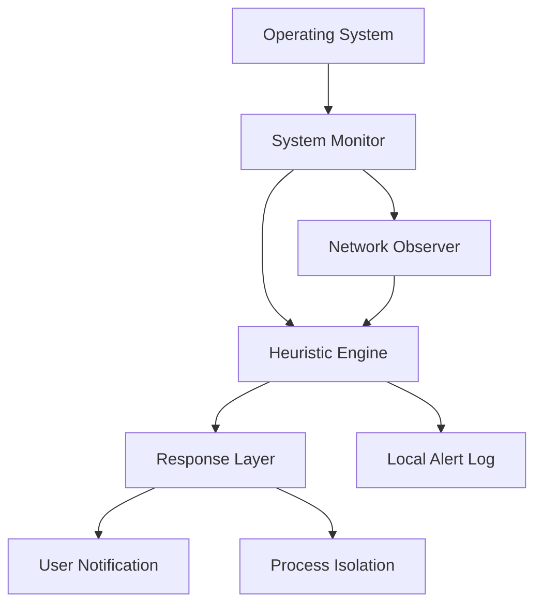
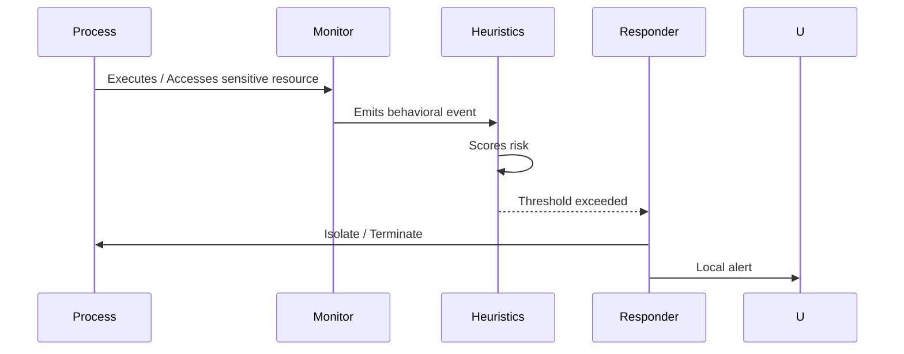
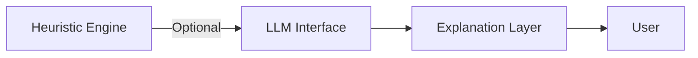

# Tanuki


Tanuki is a local-first privacy defense agent that monitors operating system behavior to detect malware, credential theft, and wallet-draining activity.

It is behavior-driven, privacy-preserving, and designed to run entirely on the user’s machine.

No telemetry.  
No cloud dependency.  
No user data collection.

---

## Scope

Tanuki focuses on:
- Behavioral malware detection
- Credential and wallet-drain prevention
- Suspicious process and network activity correlation

Tanuki is **not** a traditional antivirus and does not rely on signature databases.

---

## System Architecture



---

## Behavioral Detection Flow



---

## Multi-LLM Integration

Tanuki supports optional local or remote LLMs for **analysis and explanation only**.

LLMs are **never required** for core protection.

### Supported Modes
- Local models (llama.cpp, Ollama, LM Studio)
- Remote APIs (OpenAI, Anthropic, others)

### Use Cases
- Explaining why an action was flagged
- Summarizing behavioral patterns
- Assisting advanced users with forensic review

### LLM Architecture



### Configuration

LLMs are fully optional and user-controlled.

```bash
export TANUKI_LLM_PROVIDER=openai
export TANUKI_OPENAI_KEY=your_key_here
```

Or:

```bash
export TANUKI_LLM_PROVIDER=local
export TANUKI_LOCAL_MODEL=llama3
```

No keys are stored or transmitted.

---

## Repository Layout

```
tanuki/
├── agent/
│   ├── core.py
│   ├── monitor.py
│   ├── heuristics.py
│   ├── network.py
│   └── responder.py
├── llm/
│   ├── interface.py
│   ├── local.py
│   └── remote.py
├── platform/
│   ├── linux.py
│   ├── macos.py
│   └── windows.py
├── rules/
├── docs/
├── cli/
└── README.md
```

---

## Privacy Model

- All analysis is local by default
- LLM usage is opt-in
- No telemetry
- No background network calls

---

## Status

Early development.

---

## License

MIT
